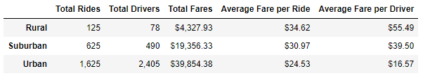
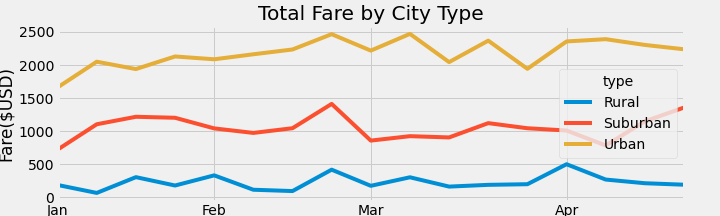

# Module 5 Challenge: PyBer_Analysis

## Overview
PyBer is a ride-sharing app company and the rideshare data from the past few months needs to be analayzed. we need to create a summary Dataframe of the ride-sharing data by city type. In addition to the dataframe, a multiple line plot is needed to visualize the total weekly fares for each city type.

## Results
The summary is shown below in table 1. 
* Urban and rural have the highest and lowest number of rides respectively which is expected. 
* Urban and rural have the most and least number of drivers which is also expected. 
* Total Fares generated is the highest for Urban and lowest for rual. 
* Averge fare ride has the opposite trend. Its the highest for  the Rural and the lowest for Urban. 
* Average fare per driver has the same trend as the Averge fare ride. Its the highest for  the Rural and the lowest for Urban. 

Table. 1: summary of ride-share data
 

The total fare is plotted for each city type in Fig.1. 
From January to end of April, total fare for each type is relatively constant with slight dip in Jan. 

 
 Fig.1: Total Fare by City Type

## PyBer_Analysis Summary
In summary urban areas generate the most profit becaue of the higher total fares. However, the fare per ride is the highest for rural areas.
There are way too many drivers in Urban areas. Some of them didn't even have one ride in the past 4 months. 
The generated total fare for each city type is "almost" constant over time.
